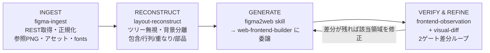
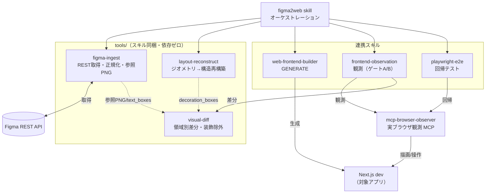

# figma2web

Figma デザインを **見た目はピクセル単位で忠実に、実装は Web ベストプラクティスで** Next.js に再現するための **Claude Code スキル + ツール群**。

figma2web は **レイヤーツリーを無視して絶対ジオメトリから構造を再構築**し、**サーバーレンダリングの参照画像とのスクリーンショット差分ループ**で忠実度を詰める。

## 何ができるか

Figma の任意のフレーム／ページを、**見た目はピクセル単位で忠実に、コードは Web ベストプラクティスで** Next.js のコンポーネントに起こす。ランディングページでも下層ページでも、同じワークフローで再現性高く実装できる。

複数ページ／サイトに展開する場合は、Figma の `componentId` で同一コンポーネントのインスタンスを束ね、**共有コンポーネントを 1 回だけ実装→各ページで再利用**する（desktop/mobile バリアント＝レスポンシブ、状態バリアント＝props）。

## 中核思想

1. **Figma は「見た目の正解」であって「構造の正解」ではない** — レイヤーツリーはヒント。構造は全ノードの `absoluteBoundingBox`（絶対座標）から再構築する。
2. **Figma は視覚的にも未完成** — literal にコピーせず、レスポンシブ・テキスト折返し・セマンティクス・状態は Web ベストプラクティスで補う。
3. **忠実度を 2 ゲートに分離** — ゲートA（デザイン幅固定で参照PNGと領域別比較）／ゲートB（複数幅で overflow・a11y・状態。ピクセル差分しない）。差分ループはゲートAだけを駆動。
4. **テキスト/装飾は除外して「実コンテンツ忠実度」で測る** — フォントレンダラ差や画像背景の CSS 近似は想定ノイズ。除外して測ることでスコアが意味を持つ。

## パイプライン（4 ステージ）



複数ページに展開する場合も同じパイプラインを各ページに回すだけ。**共有コンポーネントを 1 回実装し、各ページは「共有コンポーネントの合成 ＋ 固有セクション」で再現**する。

## アーキテクチャ

`figma2web` スキルが全体をオーケストレーションし、**スキルに同梱した中核ツール**（`.claude/skills/figma2web/tools/`）と連携スキルを駆動する。観測能力は MCP に集約。



## 構成

```
.claude/skills/
  figma2web/                オーケストレーションスキル（中核ツールを同梱＝自己完結）
    SKILL.md
    tools/                  依存ゼロの Node + Python ツール
      figma-ingest.js       REST取得→model.json/ref.png/assets/index.json/text_boxes.json
                            （componentFamilies でファミリー＋バリアントも解決）
      layout-reconstruct.js 絶対ジオメトリ→候補IR + decoration_boxes.json
      lib/                  figma-url / figma-rest / normalize / geometry / fonts / env
      visual-diff/          overlay.py（構造目視）/ visual_diff.py（領域別差分・装飾除外）
      README.md
  frontend-observation/     観測（ゲートA/B）。同梱・カスタマイズ済み
  playwright-e2e/           回帰テスト。同梱・カスタマイズ済み
  web-frontend-builder/     GENERATE 被委譲。同梱・カスタマイズ済み
.claude-plugin/             プラグイン配布用マニフェスト（plugin.json / marketplace.json）
.env.example                Figma トークン設定の雛形
.mcp.json.example           browser-observer MCP（localhost許可）の雛形
```

ツールは figma2web スキルの中（`tools/`）に同梱され、スキルは絶対パス `${CLAUDE_SKILL_DIR}/tools/...`
で参照する。**スキルを置けばツールも必ず付いてくる**ので、コピー漏れで動かない問題が起きない。

## 連携スキルと原典

観測/検証/生成は同梱スキル（`.claude/skills/` に figma2web 用カスタマイズ済み）に委譲する。実ブラウザ観測の MCP のみ別途導入する。

| スキル | 同梱 | 役割 | 原典 (upstream) |
|---|---|---|---|
| `mcp-browser-observer`（MCP） | 別途導入 | 実ブラウザ観測（DOM/console/network/スクショ） | https://github.com/MizukiMachine/mcp-browser-observer |
| `frontend-observation` | 同梱 | 描画/動作の即時検証観点 | https://github.com/MizukiMachine/codex-skill-public/tree/develop/frontend-observation |
| `playwright-e2e` | 同梱 | 恒久的な回帰テスト | https://github.com/MizukiMachine/codex-skills-public/tree/develop/playwright-e2e |
| `web-frontend-builder` | 同梱 | GENERATE の被委譲（本番品質 UI 実装） | https://github.com/MizukiMachine/codex-skills-public/tree/develop/web-frontend-builder |

MCP は `.mcp.json.example` を参考に設定し、`BROWSER_OBSERVER_BLOCK_PRIVATE_IPS=false` を必ず付ける（localhost 観測のため）。

## セットアップ

### 1) スキルを導入する

別のアプリ（自分の Next.js プロジェクト等）で使うなら、**プラグイン導入が最短**。Claude Code で 2 コマンド:

```text
/plugin marketplace add mormorbump/figma2web
/plugin install figma2web@figma2web
```

これで figma2web スキル＋同梱ツール（`tools/`）＋検証用の連携スキル（frontend-observation /
playwright-e2e / web-frontend-builder）が**一括で入る**。スキルとツールが 1 つにまとまっているので、
コピー漏れでツールが見つからない、という問題は起きない。以後そのアプリのディレクトリで Claude Code を
起動すれば自動でスキルが効く。

<details><summary>プラグインを使わず手で配置する場合</summary>

- このリポジトリを clone してその中で作業する → `.claude/skills/` を Claude Code が自動認識（配置不要）。
- 別アプリへ手でコピーする → `.claude/skills/` を**ディレクトリごと**そのアプリ直下（または
  `~/.claude/skills/`）にコピーする。ツールはスキル内に同梱されているので一緒に付いてくる。

> upstream の `frontend-observation` / `playwright-e2e` / `web-frontend-builder` を別途入れている場合、
> 本プラグイン同梱のカスタマイズ版と同名になる。figma2web では同梱版が前提なので、二重導入は避ける。
</details>

### 2) Figma トークンを設定する（対象プロジェクト側）

ツールはトークンを **環境変数か `.env`** から読む（argv には絶対に渡さない）。対象アプリのプロジェクト
ルートで:

```bash
cp .env.example .env && $EDITOR .env   # FIGMA_SECRET_KEY と FIGMA_FILE_URL を設定
#   scope は「File content -> read」。FIGMA_FILE_URL = 対象フレームの Figma 共有URL（既定ターゲット）
#   または: export FIGMA_SECRET_KEY=figd_xxx  （.env を作らず環境変数でも可）
```

### 3) browser-observer MCP を設定する（対象プロジェクト側）

MCP はプラグインに同梱できない（外部バイナリ＋パスがマシン依存）ので、対象アプリごとに `.mcp.json` を置く:

```bash
cp .mcp.json.example .mcp.json && $EDITOR .mcp.json   # mcp-browser-observer のパスを設定
#   BROWSER_OBSERVER_BLOCK_PRIVATE_IPS=false を必ず付ける（localhost 観測のため）
#   Claude Code を再起動してプロジェクト MCP を承認する
```

> Python 差分ツールの venv は**初回実行時にスキルが自分で** `.context/figma2web/.venv` に作るので、
> 手動セットアップは不要（Node ツールは依存ゼロ＝`npm install` も不要）。

## 使い方

セットアップ後、Claude Code に **一文投げるだけ**:

> **「figma2web のスキルで実装して」**

これで INGEST（`figma-ingest`）→ 構造再構築（`layout-reconstruct`）→ 構造目視（`overlay`）→ 生成 → 2ゲート差分検証 → 自己修正まで、必要な node/python コマンドはスキルがエージェントとして自分で実行する。複数ページを扱うときは、同じ一文を各ページに対して投げるだけ。

<details><summary>各ツールを手動・単体で叩く場合（デバッグ/CI 用）</summary>

```bash
# clone した repo 内での例。plugin 導入時は SKILL=${CLAUDE_SKILL_DIR}
SKILL=.claude/skills/figma2web
node "$SKILL/tools/figma-ingest.js" --list                             # フレーム一覧（.env の FIGMA_FILE_URL を参照）
node "$SKILL/tools/figma-ingest.js" --node <id>                        # 取得（同上。--node でフレーム選択）
node "$SKILL/tools/layout-reconstruct.js" --in .context/figma/<slug>   # 構造再構築
.context/figma2web/.venv/bin/python "$SKILL/tools/visual-diff/overlay.py" --in .context/figma/<slug>  # 構造目視
```
</details>

要件: Node 20+ / Python 3.11+ / Figma PAT（File content read）/ `mcp-browser-observer`。

## ライセンス

MIT（[LICENSE](LICENSE)）。連携する外部スキルは各 upstream のライセンスに従う。
